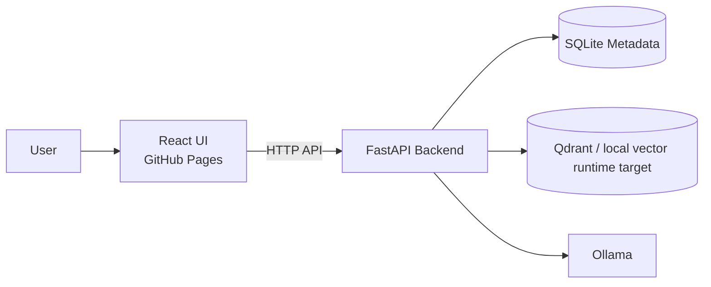
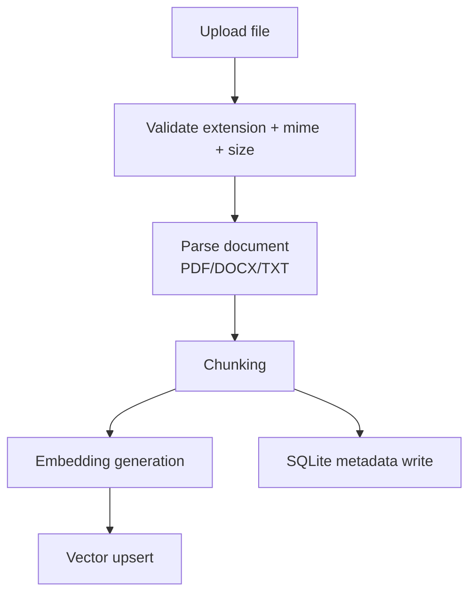
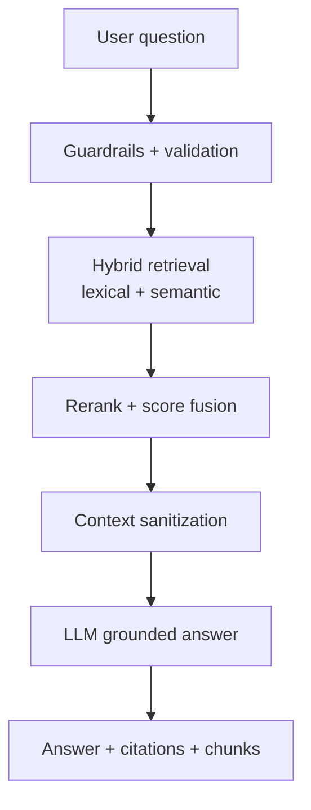
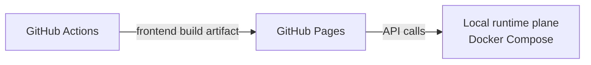

# Architecture Diagrams

## 1. Current system topology

```mermaid
flowchart LR
  User[User]
  FE[React UI<br/>GitHub Pages]
  API[FastAPI Backend]
  SQL[(SQLite Metadata)]
  QD[(Qdrant / local vector runtime target)]
  OLL[Ollama]

  User --> FE
  FE -->|HTTP API| API
  API --> SQL
  API --> QD
  API --> OLL
```

## 2. Ingestion data flow

```mermaid
flowchart TD
  U[Upload file] --> V[Validate extension + mime + size]
  V --> P[Parse document<br/>PDF/DOCX/TXT]
  P --> C[Chunking]
  C --> E[Embedding generation]
  E --> VS[Vector upsert]
  C --> M[SQLite metadata write]
```

## 3. Query and grounded QA flow

```mermaid
flowchart TD
  Q[User question] --> G[Guardrails + validation]
  G --> R[Hybrid retrieval<br/>lexical + semantic]
  R --> RR[Rerank + score fusion]
  RR --> S[Context sanitization]
  S --> L[LLM grounded answer]
  L --> OUT[Answer + citations + chunks]
```

## 4. Deploy model

```mermaid
flowchart LR
  GH[GitHub Actions]
  PAGES[GitHub Pages]
  LOCAL[Local runtime plane<br/>Docker Compose]

  GH -->|frontend build artifact| PAGES
  PAGES -->|API calls| LOCAL
```
